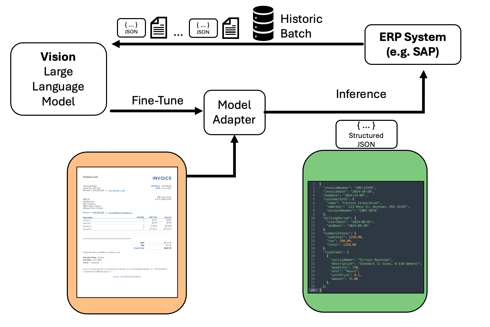
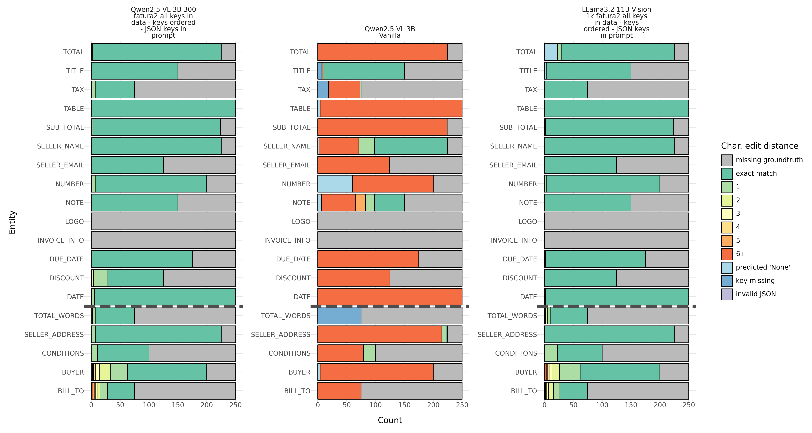
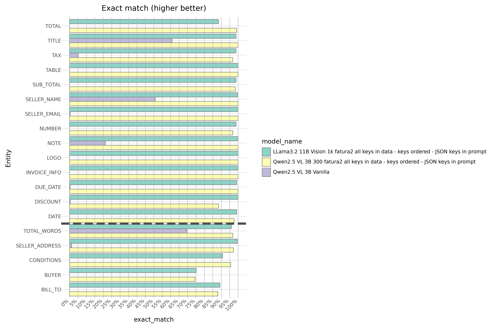

# Fine-Tuning and Evaluating Vision LLMs for Multipage Document-to-JSON Conversion using Amazon SageMaker AI

This open-source project delivers a complete pipeline for converting multi-page documents (PDFs/images) into structured JSON using Vision LLMs on Amazon SageMaker. The solution leverages the [SWIFT Framework](https://github.com/modelscope/ms-swift) to fine-tune models specifically for document understanding tasks.

The repository features extensive evaluations through a comprehensive notebook collection that guides users through every step of the process - from dataset preparation to model deployment and performance assessment. The implementation has been validated using both the public Fatura2 invoice dataset and a private German invoice dataset with promising results.

<figure>
    
    <figcaption style="text-align: left; font-style: italic; color: #666;">
        Figure 1: Architecture diagram showing the document to JSON conversion process for fine-tuning Vision LLMs by using historic data. This allows to learn from high data variations and makes sure the structured output matches the target system structure and format.
    </figcaption>
</figure>

## Key Features

- **End-to-End Document Processing**: From raw images or PDF document to structured JSON output
- **SageMaker Integration**: Leverages AWS infrastructure for cost-efficient training and inference
- **Multi-Modal Support**: Handles both image (PNG/JPG) and PDF document inputs
- **JSON constrained Decoding**: Uses [structured outputs in VLLM](https://docs.vllm.ai/en/latest/features/structured_outputs.html) to produce the results.
- **Advanced Evaluation**: Comprehensive metrics for Model Evaluatuon and Comparison on general JSON outputs to measure real world performance.
- **Deployment Ready**: Includes batch inference and endpoint deployment solutions

## Implementation Workflow
The project is organized into seven detailed notebooks covering:

1. **Dataset conversion to Hugging Face format**: [01_optional_convert_fatura2_to_hf_dataset.ipynb](01_optional_convert_fatura2_to_hf_dataset.ipynb)
2. **Creation of Swift-compatible training data**: [02_create_custom_dataset_swift.ipynb](02_create_custom_dataset_swift.ipynb)
3. **Model fine-tuning on SageMaker**: [03_finetune_swift.ipynb](03_finetune_swift.ipynb)
4. **Batch inference for large document sets**: [04_run_batch_inference.ipynb](04_run_batch_inference.ipynb)
5. **Comprehensive model evaluation**: [05_evaluate_model.ipynb](05_evaluate_model.ipynb)
6. **Endpoint Deployment**: [06_deploy_model_endpoint.ipynb](06_deploy_model_endpoint.ipynb)
7. **Consume Model Endpoint**: [07_consume_model.ipynb](07_consume_model.ipynb)

## Evaluation Highlights

The repository includes a dedicated evaluation notebook (`05_evaluate_model.ipynb`) that performs:

- Field-level accuracy assessment for both keys and values
- Text quality measurement using multiple metrics
- Detailed visualization of JSON extraction results
- Comparative analysis between different model versions

The evaluation framework is particularly valuable as it allows for objective measurement of how well the models extract structured information from complex documents, with specialized metrics for different data types found in documents.

### Strutured JSON Evaluation with Character Edit Distance Heatmap

Let's look at some results when using Qwen2.5 VL 3B out of the box (vanilla), fine-tuning Qwen2.5 VL 3B, and fine-tuning Llama 3.2 11B Vision on the Fatura2 dataset. We run inference on 250 random samples of the Fatura2 dataset that are not used during fine-tuning. 

The graph below displays a comparative heatmap visualization of character edit distances for the three vision language models performing document-to-JSON extraction. Vanilla Qwen2.5 VL 3B model demonstrates considerable limitations. Without fine-tuning Qwen2.5 VL 3B only achieves decent results on extracting the TITLE and SELLER_NAME from the documents. Both the fine-tuned Qwen2.5 VL 3B (trained on 300 fatura2 examples) and Llama3.2 11B Vision (trained on 1k fatura2 examples) exhibit highly improved extraction capabilities, with predominant green regions representing exact matches across most attributes. These results suggest that fine-tuning vision language models can yield comparable high-quality results for document understanding and structured data extraction workflows. We expect to to perform especially well in domains where there is a high variation of 

<figure style="display: block; text-align: left;max-width: 1200px;">
    
    <figcaption style="text-align: left; font-style: italic; color: #666;">
        Figure 2: Evaluation Heatmap for Character Edit Distance: Fine-tuning allows to dramatically improve the results, without manual prompt engineering.
    </figcaption>
</figure>

### Comparing Models over Exact Match per Entity

<figure style="display: block; text-align: left;max-width: 800px;">
    
    <figcaption style="text-align: left; font-style: italic; color: #666;">
        Figure 3: Comparing Models over Exact Match per Entity. Qwen2.5-VL 3B performs just as good as Llama3.2-11B-Vision.
    </figcaption>
</figure>

### Aggregated Model Comparison Across All Entities

\* (star) indicates best value

|    | model                                                                                | pretty_name                                                                          |   rouge1 |   rouge2 |   rougeL |   rougeLsum | model_name                               |   accuracy (exact match) |   cer_score |
|---:|:-------------------------------------------------------------------------------------|:-------------------------------------------------------------------------------------|---------:|---------:|---------:|------------:|:-----------------------------------------|-------------------------:|------------:|
|  0 | data/results/infer-json-8xlarge-finetune-qwen2-5-vl--2025-03-21-10-27-17-087/results | Qwen2.5 VL 3B 300 fatura2 all keys in data - keys ordered - JSON keys in prompt      |     0.99 |     **0.53*** |     0.99 |        0.99 | Qwen/Qwen2.5-VL-3B-Instruct              |                     0.98 |  **0.00179195*** |
|  1 | data/results/infer-json-Qwen-Qwen2-5-VL-3B-Instruct-2025-03-18-00-36-24-726/results  | Qwen2.5 VL 3B Vanilla                                                                |     0.34 |     0.17 |     0.34 |        0.34 | Qwen/Qwen2.5-VL-3B-Instruct              |                     0.1  |  0.824963   |
|  2 | data/results/infer-json-finetune-llama-3-2-11b-visio-2025-03-17-22-50-45-144/results | LLama3.2 11B Vision 1k fatura2 all keys in data - keys ordered - JSON keys in prompt |     **1***    |     **0.53*** |     **1***    |        **1***    | meta-llama/Llama-3.2-11B-Vision-Instruct |                    **0.99*** |  0.00980112 |

## Key Takeaways

* Fine-tuning vision LLMs allows to capture high document variation for document to JSON.
* Small models (3B, 7B, 11B parameters) perform extremely well. For example Qwen2.5 VL 3B trained on 300 samples achieves 98% accuracy on exact value extraction (exact match) for the Fatura2 dataset.
* We only spent limited time training larger models (> 70B parameters). Smaller models outperformed larger models. We think that larger models will have to be trained for longer and on more data.
* The following data preparation steps improved the model:
    * Fill missing JSON keys with null.
    * Ordering the keys in the JSON so that they are always in the same order.
    * We have a minimal prompt but did include the keys that the model is supposed to extract as a list in the prompt.
* JSON constrained decoding can make sure to generate valid JSON. On a private dataset, on which we also trained, JSON constrained decoding was helpful to reduce the model generating invalid JSON. After applying the data preparation steps on the Fatura2 dataset we do not observe any invalid JSON and do not see a need to use JSON constrained decoding for this dataset.
* Fine-tuning vision LLMs for document to JSON processing can be done cost effectively using Spot Instances, small models, and small datasets.

## Costs
Running the notebooks in this repository will occur cost, for example for model training and inference. The cost will depend on how big the model is you are fine-tuning, how large your dataset is, the hyperparameters configuration, and as a result the instance type selected and whether spot training is used. Here is a cost example from one of the models we fine-tuned in us-west-2 (Oregon) region:

|    | model                                                                                | pretty_name                                                                          |   task | spot? | instance type |  billable time (seconds)  |   on-demand hourly rate  |   total cost (USD) | notes |
|---:|:-------------------------------------------------------------------------------------|:-------------------------------------------------------------------------------------|---------:|---------:|---------:|---------:|------------:|:-----------------------------------------|---------|
|  0 | data/results/infer-json-Qwen-Qwen2-5-VL-3B-Instruct-2025-03-18-00-36-24-726/results  | Qwen2.5 VL 3B                                                                 |     fine-tuning |     spot |     ml.g6.8xlarge |       2829 s | $2.0144       | $1.58 |
|  1 | data/results/infer-json-Qwen-Qwen2-5-VL-3B-Instruct-2025-03-18-00-36-24-726/results  | Qwen2.5 VL 3B                                                                 |     batch inference |     spot |     ml.g6e.xlarge |       675 s | $1.861       | $0.35 | 250 documents processed. 

Keep in mind that the inference job takes additional time for downloading the dataset, downloading the model and merging the LoRA adapter with the base model. In the above example fine-tuned Qwen2.5 VL 3B on a ml.g6e.xlarge instance processes 1.16 documents per second. So  when batch processing more document at once the price should approach $0.45 per 1000 pages.

## Notebooks and Structures

### Notebook 01: [`01_optional_convert_fatura2_to_hf_dataset.ipynb`](01_optional_convert_fatura2_to_hf_dataset.ipynb)
**Converting Fatura2 Dataset to Hugging Face Format**  
Prepares the Fatura2 dataset for document processing tasks:
- This notebook is optional. You can also
      * Start with Notebook 02: [`02_create_custom_dataset_swift.ipynb`](02_create_custom_dataset_swift.ipynb) and download the dataset from the HuggingFace Hub
      * If you are using your own dataset then you should start with Notebook 02: [`02_create_custom_dataset_swift.ipynb`](02_create_custom_dataset_swift.ipynb) and adapt it to convert your dataset into the required swift dataset format.
- Downloads and extracts raw dataset
- Creates train/dev/test splits with multiple strategies
- Exports to Parquet format
- Optional upload to Hugging Face Hub
- uses a third-party dataset licensed under The Creative Commons Attribution 4.0 International (CC BY 4.0).
    * M. Limam, M. Dhiafand Y. Kessentini, ‘FATURA Dataset’. Zenodo, Dec. 13, 2023. doi: 10.5281/zenodo.10371464.
    * [FATURA: A Multi-Layout Invoice Image Dataset for Document Analysis and Understanding](https://arxiv.org/abs/2311.11856)

### Notebook 02: [`02_create_custom_dataset_swift.ipynb`](02_create_custom_dataset_swift.ipynb)
**Creating Swift-Compatible Training Dataset**  
Transforms processed data into ModelScope Swift format:
- Handles multi-page PDF/image inputs
- Normalizes bounding box coordinates
- Integrates with S3 for cloud storage
- Generates training-ready JSONL files

### Notebook 03: [`03_finetune_swift.ipynb`](03_finetune_swift.ipynb)
**SageMaker Fine-Tuning Pipeline**  
Implements model training:
- Configures SageMaker training jobs
- Implements ModelScope Swift framework
- Monitors training metrics
- Manages model checkpoints

### Notebook 04: [`04_batch_inference.ipynb`](04_batch_inference.ipynb)
**Batch Inference Implementation**  
Large-scale document processing solution:
- Utilizes SageMaker @remote decorator
- Supports local/cloud execution switching
- Processes entire test sets efficiently
- Manages GPU resource allocation

### Notebook 05: [`05_evaluate_model.ipynb`](05_evaluate_model.ipynb)
**Model Evaluation Framework**  
Comprehensive performance analysis:
- Exact Match (EM) and Character Error Rate (CER)
- ROUGE metrics for text fields
- Feature-type specific analysis
- Detailed JSON result visualizations
- Comparison of multiple models

### Notebook 06: [`06_deploy_model_endpoint.ipynb`](06_deploy_model_endpoint.ipynb)
**Endpoint Deployment**  
SageMaker endpoint creation:
- Container building and ECR upload
- Endpoint testing and validation
- Cost-optimized deployment strategies

### Notebook 07: [`07_consume_model.ipynb`](06_deploy_model_endpoint.ipynb)
**Invoking Fine-Tuned Document to JSON Multi-Modal Model**
Demonstrates how to process documents using a deployed SageMaker endpoint for document-to-JSON conversion.
- Includes helper functions for encoding images, preparing payloads, and invoking the SageMaker endpoint.
- Allows optional use of structured output/constrained decoding with JSON schemas to guide the model's response structure.
- Provides functionality to display the input document image and extracted JSON information side by side.

### Future Improvements

* Add support of Table Comparison in JSON through Table metrics like [TEDS](https://arxiv.org/abs/1911.10683) or [GriDTS](https://arxiv.org/pdf/2203.12555), see this [blog](https://nanonets.com/blog/table-extraction-using-llms-unlocking-structured-data-from-documents/) for an overview
* Add Multi Adapter deployment
Invoking Fine-Tuned Document to JSON Multi-Modal Model

## Contributing

Contributions are welcome! Please open an issue first to discuss proposed changes.

## Contributors

* Arlind Nocaj
* Malte Reimann
* Nick McCarthy